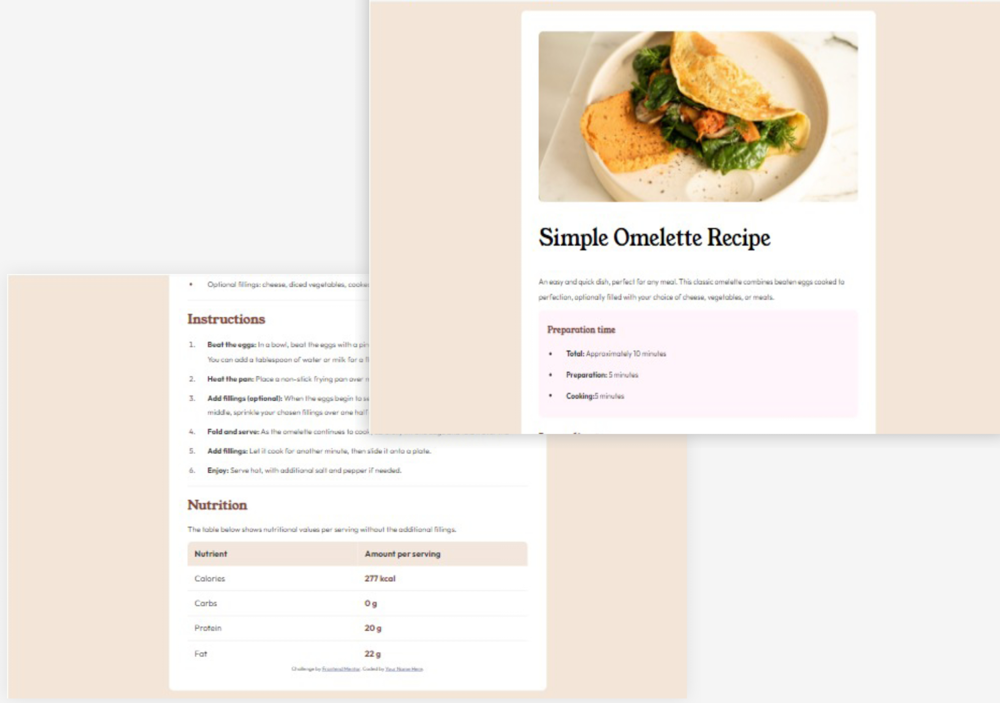
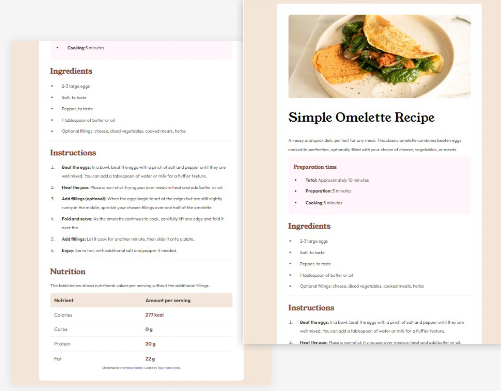

# Frontend Mentor - Recipe page solution

This is a solution to the
[Recipe page challenge on Frontend Mentor](https://www.frontendmentor.io/challenges/recipe-page-KiTsR8QQKm).
Frontend Mentor challenges help you improve your coding skills by building
realistic projects.

## Table of contents

- [Overview](#overview)
  - [The challenge](#the-challenge)
  - [Screenshot](#screenshot)
  - [Links](#links)
- [My process](#my-process)
  - [Built with](#built-with)
  - [What I learned](#what-i-learned)
  - [Continued development](#continued-development)
  - [Useful resources](#useful-resources)
- [Author](#author)
- [Acknowledgments](#acknowledgments)

**Note: Delete this note and update the table of contents based on what sections
you keep.**

## Overview

### Screenshot






### Links

- Solution URL:
  [Add solution URL here](https://github.com/Mubarak-Adeyemi/recipe-page-main)
- Live Site URL:
  [Add live site URL here](https://mubarak-adeyemi.github.io/recipe-page-main/)

## My process

### Built with

- Semantic HTML5 markup
- CSS custom properties
- Flexbox

### What I learned

Semantic HTML: I used semantic elements (<header>, <main>, <section>, <footer>,
etc.), which improves accessibility and SEO. This makes the structure of the
content clearer for both developers and search engines.

```html
<header>
  
</header>

<section class="heading">
  <h1>Simple Omelette Recipe</h1>
  <p>
    An easy and quick dish, perfect for any meal. This classic omelette combines
    beaten eggs cooked to perfection, optionally filled with your choice of
    cheese, vegetables, or meats.
  </p>
</section>

<footer>
  <div class="attribution">
    Challenge by
    <a href="https://www.frontendmentor.io?ref=challenge" target="_blank"
      >Frontend Mentor</a
    >. Coded by
    <a href="https://www.frontendmentor.io/profile/Mubarak-Adeyemi"
      >Mubarak Adeyemi</a
    >.
  </div>
</footer>
```

CSS Custom Properties (Variables): I utilized custom properties (CSS variables)
like `--stone100`, `--brown800`, etc. This makes it easier to maintain and
update styles across the entire stylesheet. Changing a single variable can
update the color scheme or design theme globally.

```css
:root {
  --stone100: hsl(30, 54%, 90%);
  --stone150: hsl(30, 18%, 87%);
  --stone600: hsl(30, 10%, 34%);
  --stone900: hsl(24, 5%, 18%);
  --brown800: hsl(14, 45%, 36%);
  --rose800: hsl(332, 51%, 32%);
  --rose50: hsl(330, 100%, 98%);
  --bodyColor: hsl(0, 0%, 20%);
  --white: hsl(0, 0%, 100%);
  --black: hsl(0, 0%, 0%);
  --theadbg: hsl(27, 48%, 91%);
}
```

Responsive Design with Media Queries: The CSS includes media queries to adapt
the layout to different screen sizes (max-width: 900px and max-width: 768px).
This demonstrates a responsive design techniques ensuring the webpage is
accessible and user-friendly across a range of devices.

```css
@media screen and (max-width: 768px) {
  body {
    margin: 0;
    font-size: 0.89em;
  }
  .container {
    width: 100%;
    background-color: var(--white);
    padding: 0 0 20px;
  }
  h1 {
    font-size: 2em;
  }
  header img {
    width: 100%;
    height: auto;
    border-radius: 0;
  }
}
```

Typography and Font Management: The use of Google Fonts (Outfit and Young Serif)
for styling the text shows how to enhance the visual appeal of a webpage. It
also demonstrates the importance of choosing appropriate font families for
readability and aesthetic alignment with the design theme.

```css
h1 {
  font-size: 2.5em;
  color: var(--black);
  font-family: "Young Serif", serif;
  font-weight: 400;
}
```

Use of Pseudo-Elements and Selectors: Pseudo-elements like ::marker are used to
style list markers, enhancing the look of the content. This also shows knowledge
of more advanced CSS features to create a more customized and unique look.

```css
.ingredients li::marker,
.instructions li::marker {
  color: var(--brown800);
}
```

### Continued development

Exploring CSS Grid and Flexbox more deeply for complex layouts could be
beneficial.

### Useful resources

- [MDN Web Docs](https://developer.mozilla.org/) - An essential resource for
  understanding HTML and CSS offering in-depth documentation and examples for
  all web development concepts.

- [Google Fonts](https://fonts.google.com/) - A vast library of free fonts to
  use in web development projects, as seen in the code above.

## Author

- Frontend Mentor -
  [@Mubarak-Adeyemi](https://www.frontendmentor.io/profile/Mubarak-Adeyemi")
- Twitter -
  [@MubarakElarabiy](https://x.com/mubarakElarabiy?t=dIaedCkOJLk9K0-tB1tS9w&s=09)

## Acknowledgments

Thanks to those who contribute to open-source projects and resources that make
learning and coding more accessible for everyone.
